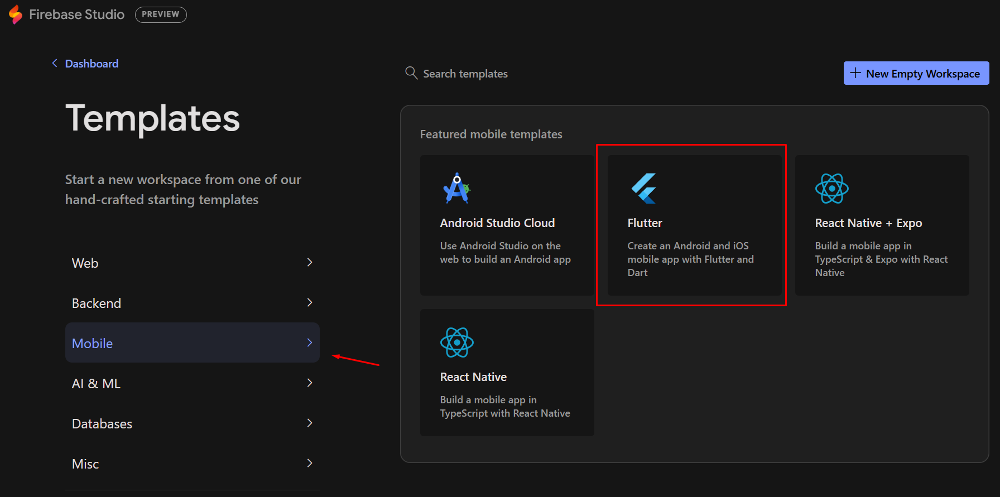
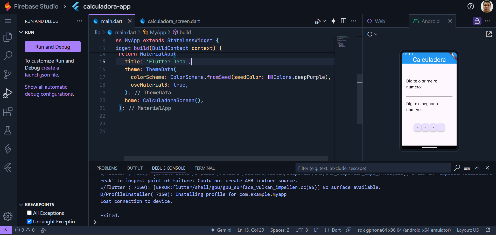

# VinciPizza - A Pizzaria "FAKE" da Faculdade VINCIT

Esse app foi desenvolvido em conjunto com os alunos dos cursos de tecnologia da [Faculdade VINCIT](https://www.faculdadevincit.edu.br/).

O app consiste em um sistema de delivery para uma pizzaria fake, cujo objetivo é ensinar aos alunos o funcionamento dos widgets, listagem de elementos e comunicação entre as telas.

## Plataformas utilizadas

Tradicionalmente, você poderá utilizar o ambiente de programação em Flutter, podendo ser instalado em Linux, Windows e macOS, ou então acessando a plataforma do [Firebase Studio](https://idx.google.com/).

### Instalação do ambiente local de desenvolvimento:

Para prosseguir com o ambiente local de desenvolvimento, você deve instalar os seguintes componentes:

- [SDK do Flutter](https://docs.flutter.dev/get-started/install)
- [Visual Studio Code](https://code.visualstudio.com/download)
- [Flutter Extension](https://marketplace.visualstudio.com/items/?itemName=Dart-Code.flutter)
-  [Dart Extension](https://marketplace.visualstudio.com/items/?itemName=Dart-Code.dart-code)
  
Também produzi um vídeo com as orientações a respeito da instalação do ambiente Flutter no microsoft Windows. Você poderá acessá-lo a qualquer momento clicando na imagem a seguir:

### Utilização do Firebase Studio

O ambiente de programação do Firebase Studio permite o desenvolvimento de aplicativos online sem a necessidade de nenhum componente ser instalado. Na data em que esse material foi produzido, o Firebase Studio estava em desenvolvimento, e não possuía nenhum custo para ser utilizado. A única limitação é que somente poderia haver 5 projetos por conta.

Para a acessar o Firebase Studio, você deve clicar [neste link](https://idx.google.com/).

Em seguida, para desenvolver o aplicativo, você deve clicar em "New Workspace" e selecionar a opção "Mobile", presente no menu lateral esquerdo. Em seguida, você deve clicar em Flutter.

Por fim, ao clicar no botão, um novo projeto será configurado e você será redirecionado ao ambiente de programação com o VS Code Online:

## Licença e termos de uso
Você pode acessar os termos de uso do app [clicando aqui](PRIVACY.md).

---
Desenvolvido por [Alex Rocha](https://www.linkedin.com/in/alexdiegorocha/)